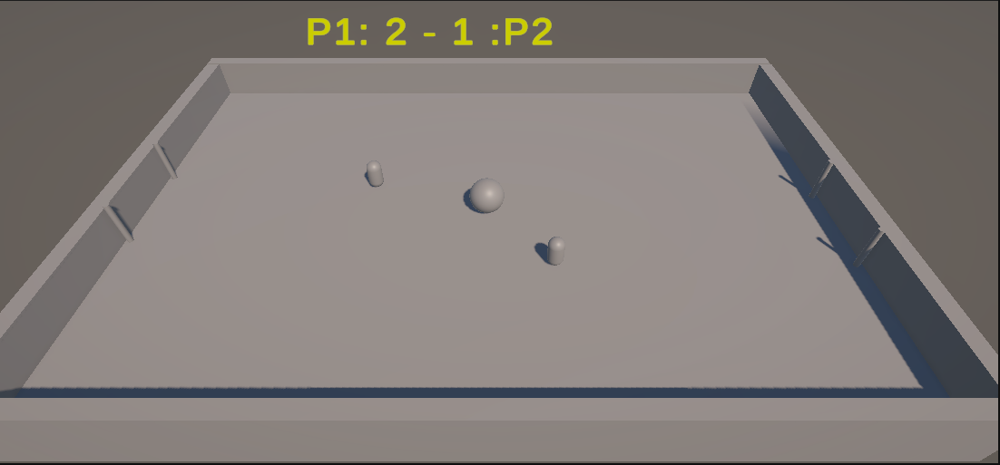
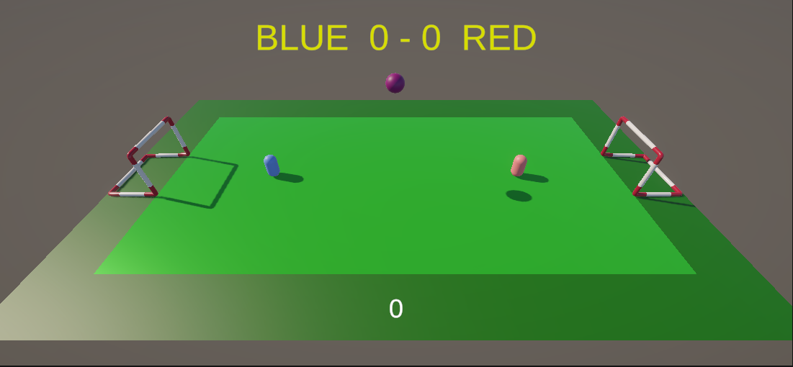
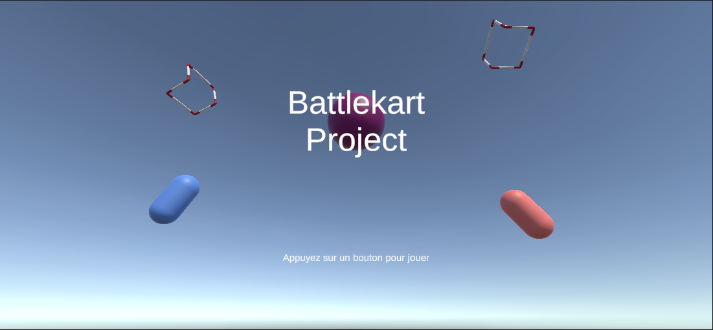
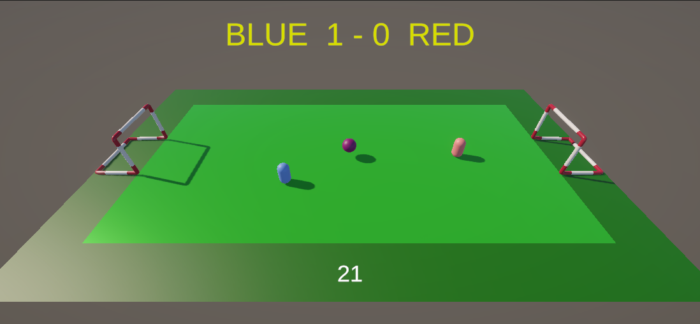

# Contexte  
Ce projet a pour but de créer un jeu de football en 3D en utilisant Unity et C#.

## Touches du jeu  
* Joueur 1 : contrôles via **WASD**  
* Joueur 2 : contrôles via les **flèches directionnelles**  
* Pause via la touche **ECHAP**

## Fonctionnalités du prototype  
| Fonctionnalité                          | Statut                |
|---------------------------------------|-----------------------|
| Joueurs et contrôles (WASD / flèches) | Implémenté            |
| Pause via ECHAP                       | Implémenté            |
| Horloge durant le match               | Implémenté            |
| Musique de fond                      | Implémenté            |
| Ballon avec interaction physique      | Implémenté            |
| Gestion des collisions                | Implémenté            |
| Collision joueur / murs               | Partiellement implémenté |
| Configuration personnalisée des touches| Non implémenté       |
| Configuration graphique               | Non implémenté        |
| Ajout de bruitages                    | Non implémenté        |

## Approche  
L’objectif était de créer un prototype fonctionnel le plus rapidement possible sans connaissance préalable d’Unity.

### Évolution du développement  
* **~3 heures :** compréhension de l’IDE et setup du projet  
* **~5 heures :** prototype jouable avec deux joueurs et système de score  

  

* **~3 heures :** ajout de l’horloge, des menus, de la musique, documentation, etc.  
  

## Choix techniques  
* Utilisation du **singleton GameManager** pour centraliser le score  
* Utilisation de **Rigidbody** et **BoxCollider** pour la physique  

# Références  
* Tutoriel Unity utilisé : [YouTube](https://youtu.be/oeiYBMMWU40?si=dXSo2cNabRke_JWj)  
* Bounce Ball : [YouTube](https://www.youtube.com/watch?v=oeiYBMMWU40&t=1818s)  
* Asset du but (filet retiré) : [Sketchfab](https://sketchfab.com/3d-models/soccer-goal-dd82dcb8975543658f4ee5097637cb39)  
* Gitignore repris de : [TwinBalls GitHub](https://github.com/EvilMindDevs/TwinBalls-Reference-Game/blob/main/.gitignore)  
* Musique Champions League : [YouTube](https://www.youtube.com/watch?v=ttjGFkand7s&list=RDttjGFkand7s&start_radio=1)  

# Images

